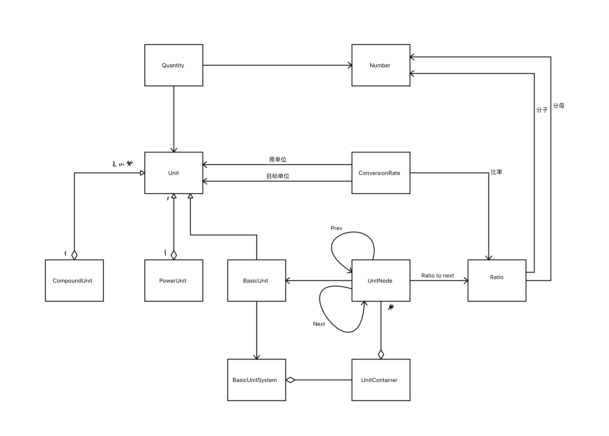

# 物理量

## 介绍

​		物理量，当用于定量描述物理现象或物理对象时，通常称为物理量。

​		几乎所有的计算机系统，都需要记录一些特定的数值，如可以用185来表示人的身高，60表示汽车的时速。但是在复杂的系统中，仅仅使用数字来表示一个物理量是不容易理解的。

​		在《分析模式》中，马丁引入“数量”的概念，将这些测量的值以数值+单位的对象来表示。这样的“数量”之间可以比较，运算，以及单位转换。

​		在Github上关于物理量的项目有很多，但大多是基于python实现的，由于本人对python的语法不太熟悉，所以自己设计了基于Java实现的“[物理量](https://github.com/Michael1024-CJX/PhysicalQuantity)”项目。

## 功能

### 具有的功能

- 自定义配置基本单位，以及单位之间的转换率。
- 创建物理量，支持基本单位和复合单位。
- 物理量可以转换为同类的单位。
- 同类物理量之间可以比较大小。
- 物理量之间可以运算，加减乘除。
  - 加减需要同类物理量。

### 缺点

- 单位的符号具有唯一性，无法表示同单位符号确实不同类型的情况
- 只有基本单位能够设置转换率，复合单位是通过基本单位来计算转换率的，所有无法设置不是由基本单位组合而成的复合单位的转换率。
  如：m^2无法转换为公顷

### 使用方式


可以通过查看 JUnit 编写的 test 了解的更多。

创建 `UnitFactory`, 默认提供了Yaml文档定义的单位之间的比率

```java
File config = new File("src/test/resources/unit/");
UnitRegister unitRegister = new YAMLUnitRegister(config);

UnitFactory factory = new DefaultUnitFactory(unitRegister);
```

通过`UnitFactory` 创建`QuanityFactory`.

```java
QuantityFactory quantityFactory = new QuantityFactory(unitFactory);
```

```java
// 通过 `QuantityFactory` 创建物理量。
PhysicalQuantity height = quantityFactory.of(180, "cm");

// 物理量能够转换单位
PhysicalQuantity heightByM = height.convertTo("m");

// 物理量能够运算，加减乘数
PhysicalQuantity multiply = height.multiply(2);

// 物理量能够比较
int compare = multiply.compareTo(height);
```

## 设计

下面介绍一下项目中几个重要的设计。

### 单位比率

单位比率应该具有传递性，比如已知cm:dm=1:10, dm:m=1:10,那么就需要推导出cm:m=1:100,这样就不必为任意两个单位定义转换率，只需要两个单位之间能够有一条转换链，就能通过运算来得到单位之间的转换率。

代码上使用链表作为数据结构，节点存储基本单位和与下一个单位的比率，最后一个没有关联的节点的比率为1.
​		

### 基本单位

只有基本单位具有实际的转换率。BasicUnit通过持有UnitSystem来取得转换率。


### 幂单位

基本单位不存在幂，或者说默认幂为1。若是需要将多个基本单位组合成复合单位，则需要考虑单位的幂。

幂单位作为装饰类，来使基本单位具有指数。计算转换率时需要进行幂运算。


### 复合单位

由带幂的基本单位组合而成的单位称为复合单位。复合单位的转换率由聚合的幂单位转换运算而来。


### 整体的类图
